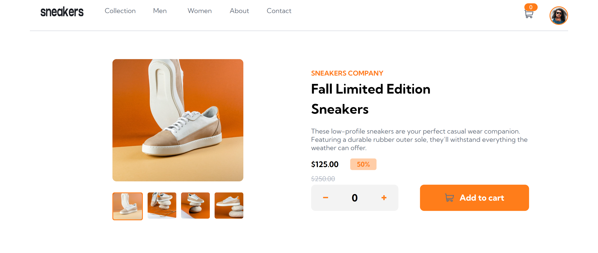

# Frontend Mentor - E-commerce product page solution

This is a solution to the [E-commerce product page challenge on Frontend Mentor](https://www.frontendmentor.io/challenges/ecommerce-product-page-UPsZ9MJp6). Frontend Mentor challenges help you improve your coding skills by building realistic projects.

## Table of contents

- [Overview](#overview)
  - [The challenge](#the-challenge)
  - [Screenshot](#screenshot)
  - [Links](#links)
- [My process](#my-process)
  - [Built with](#built-with)
  - [What I learned](#what-i-learned)
- [Author](#author)

## Overview

### The challenge

Users should be able to:

- View the optimal layout for the site depending on their device's screen size
- See hover states for all interactive elements on the page
- Open a lightbox gallery by clicking on the large product image
- Switch the large product image by clicking on the small thumbnail images
- Add items to the cart
- View the cart and remove items from it

### Screenshot

### Links

- Solution URL: [Add solution URL here](https://your-solution-url.com)
- Live Site URL: [Add live site URL here](https://your-live-site-url.com)

## My process
I first started with the navigation bar. I made the skeleton with HTML then I styled them with CSS. I used JavaScript to make the shopping cart appear and disappear as well as the menu on mobile.

As for the rest of the page, it's classic. JavaScript in particular has been fundamental to the rest of the page.

I had fun doing the responsiveness of the same screen widths, it wasn't easy, but I did my best.

I count on your comments and recommendations to be more productive.

It was a real pleasure to take up this challenge.
### Built with

- Semantic HTML5 markup
- CSS custom properties
- Flexbox
- Javascripte

### What I learned

On this project, I learned how to make slideshows with JavaScript.

## Author

- Frontend Mentor - [@henoceli3](https://www.frontendmentor.io/profile/yourusername)
- Twitter - [@HenocKodjo](https://www.twitter.com/yourusername)